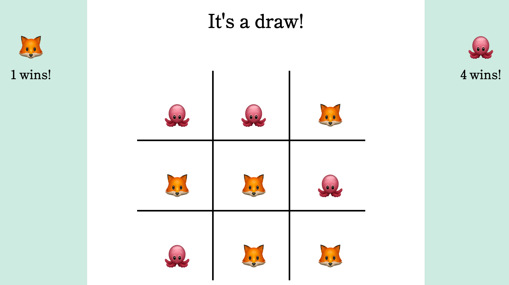

# Tic Tac Toe
### Be the first player to get there in a row!

## Description
- The player who is the fox, will always go first
- Players alternate adding their tokens on the board until either player has three in a row [horizontally, vertically, or diagonally]
- The winner of that round will receive one point
- If there is no winner, by the 9th turn, it will be considered a draw
- **The game will reset itself 3 second** after there is a winner or it ends in a draw

## Setup
- Fork this project to your own Github account
- Clone the repository to your local machine
- `cd` into the project
- `open index.html` to open GitHub pages

## Overview of project and goals
- 6 days were spent on this iteration of Tic Tac Toe
- Goal: locally store to persist players' wins after each round 

## Authors
Melanie Daoheuang [@daomeow](https://github.com/daomeow)
